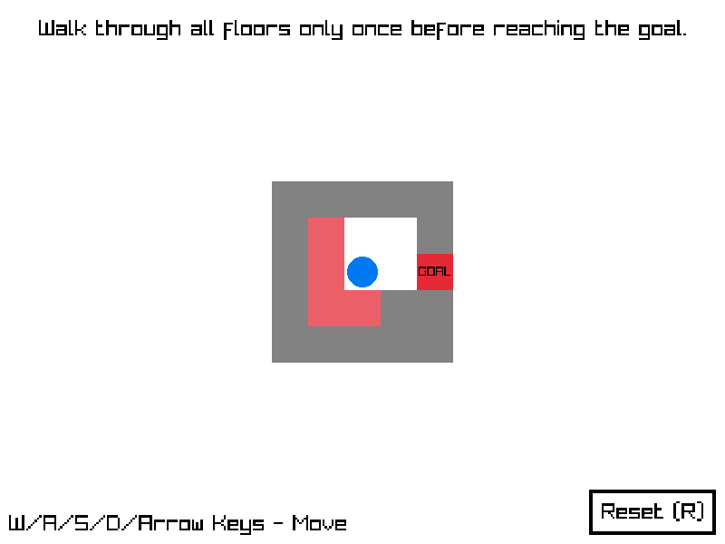

# Hamiltonian Escape

Hamiltonian Escape is a simple 2D grid-based puzzle game based on Hamiltonian paths, where for each room, you have to traverse each floor in the room at most once before reaching for the goal/exit.

The game was made using C++ and the [Raylib](https://www.raylib.com/) library compiled for HTML5. The background music was made using [PixiTracker](https://warmplace.ru/soft/pixitracker/).

This game was made as an entry for JameGam15, with the theme of "No Going Back".

You can play the game in a browser [here](https://jayzonty.itch.io/hamiltonian-escape).